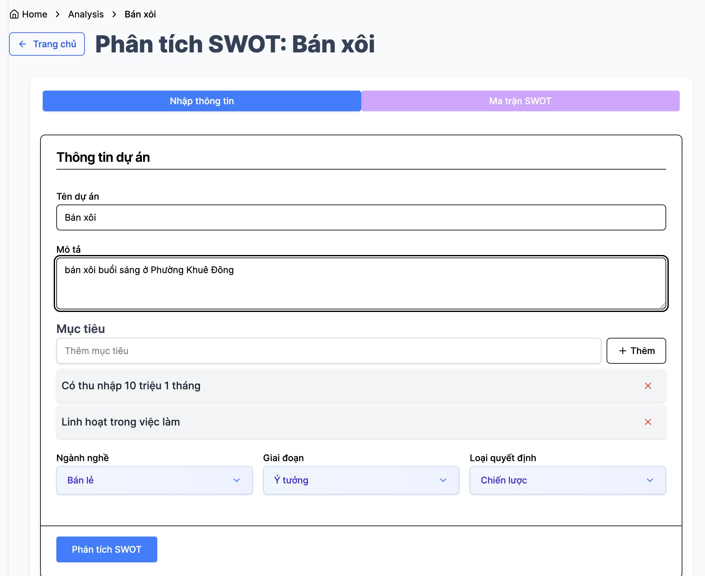
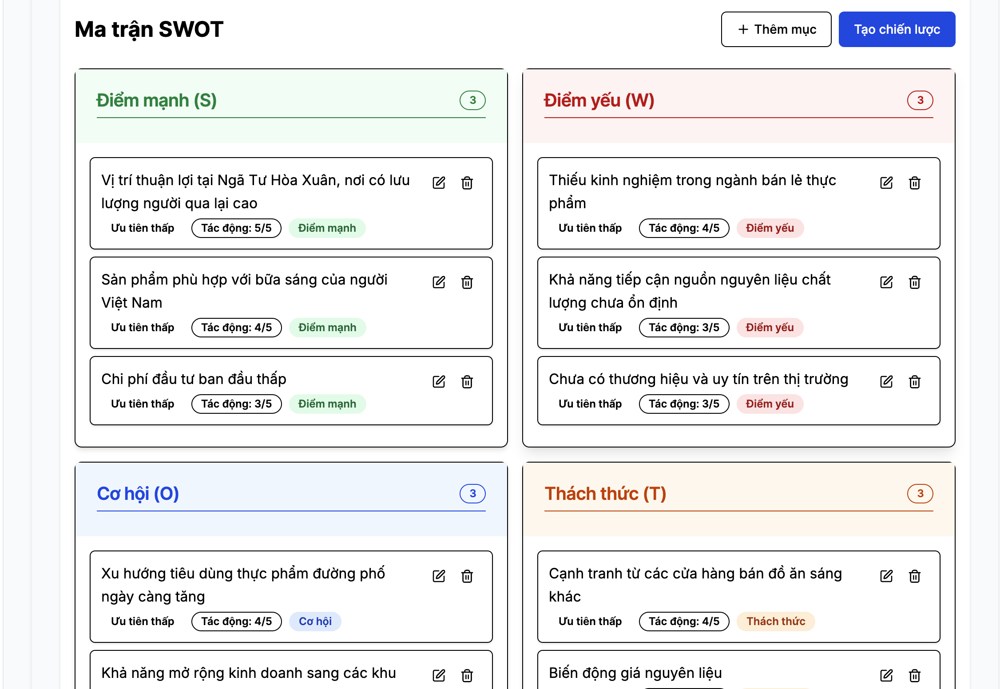

# SWOT Analysis Tool

An interactive web application for SWOT (Strengths, Weaknesses, Opportunities, Threats) analysis powered by AI. This tool helps businesses, entrepreneurs, and project managers analyze their strategic position and make informed decisions.





## Features

- 📝 **User-friendly Input Form**: Collect project/business details including description, goals, industry, stage, and decision type
- 🤖 **AI-powered Analysis**: Automatically generate SWOT suggestions based on your input using OpenAI
- 📊 **Interactive SWOT Matrix**: Easy-to-use drag-and-drop interface with customizable priorities and impact ratings
- 🔄 **Strategy Recommendations**: Generate strategic plans based on SO, WO, ST, and WT combinations
- 💾 **Save and Share**: Export your analysis as PDF or share with team members

## Quickstart

The fastest way to get started is using Docker:

```bash
# Clone the repository
git clone https://github.com/phanngoc/swot-analyzer.git
cd swot-analyzer

# Follow the prompts to add your OpenAI API key

# Start the application
docker-compose up -d db

cd frontend && npm install && npm run dev
cd backend && pip install -r requirements.txt && uvicorn app.main:app --host 0.0.0.0 --port 8000 --reload
```

Visit http://localhost:3000 in your browser to use the application!

## Tech Stack
### Prerequisites
- Node.js (v18+)
- Python (v3.9+)
- PostgreSQL database
- OpenAI API key

### Frontend
- Next.js 14 + TypeScript
- TailwindCSS for styling
- Zustand for state management
- shadcn/ui for UI components
- API routes for backend communication

### Backend
- FastAPI (Python)
- SQLModel for database ORM
- PostgreSQL database
- OpenAI integration via LangChain for AI analysis

### Environment Variables

Create a `.env` file in the root directory with the following variables:

```
# For the backend
DATABASE_URL=postgresql://postgres:postgres@db:5432/swot
OPENAI_API_KEY=your_openai_api_key

# For the frontend
NEXT_PUBLIC_API_URL=http://backend:8000
```

### Running Locally

1. Start the backend:
   ```bash
   cd backend
   pip install -r requirements.txt
   uvicorn app.main:app --reload --host 0.0.0.0 --port 8000
   ```

2. Start the frontend:
   ```bash
   cd frontend
   npm install
   npm run dev
   ```
- Python (3.10+)
- PostgreSQL
- Docker and Docker Compose (optional)

## Contributing

1. Fork the repository
2. Create a feature branch (`git checkout -b feature/amazing-feature`)
3. Commit your changes (`git commit -m 'Add some amazing feature'`)
4. Push to the branch (`git push origin feature/amazing-feature`)
5. Open a Pull Request

## License

This project is licensed under the MIT License - see the LICENSE file for details.

## Acknowledgments

- OpenAI for the AI capabilities
- All the open source libraries that made this project possible
