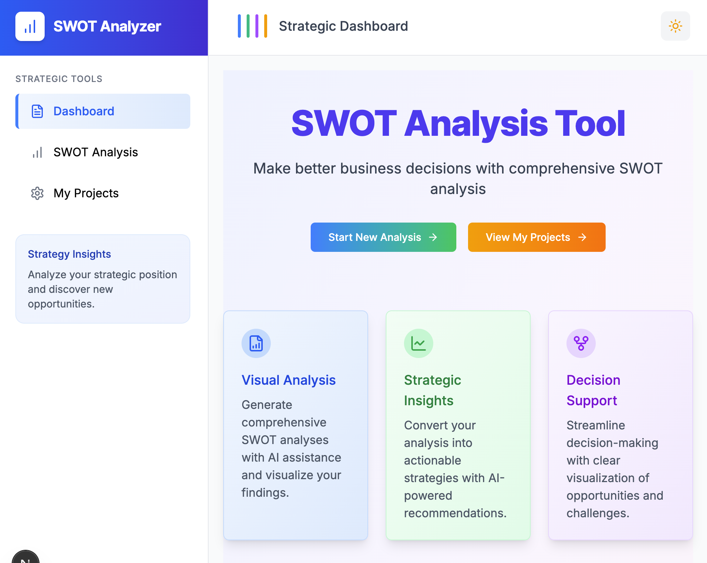

# SWOT Analysis Tool

An interactive web application for SWOT (Strengths, Weaknesses, Opportunities, Threats) analysis powered by AI. This tool helps businesses, entrepreneurs, and project managers analyze their strategic position and make informed decisions.



## Features

- 📝 **User-friendly Input Form**: Collect project/business details including description, goals, industry, stage, and decision type
- 🤖 **AI-powered Analysis**: Automatically generate SWOT suggestions based on your input using OpenAI
- 📊 **Interactive SWOT Matrix**: Easy-to-use drag-and-drop interface with customizable priorities and impact ratings
- 🔄 **Strategy Recommendations**: Generate strategic plans based on SO, WO, ST, and WT combinations
- 💾 **Save and Share**: Export your analysis as PDF or share with team members

## Quickstart

The fastest way to get started is using Docker:

```bash
# Clone the repository
git clone https://github.com/yourusername/swot-analyzer.git
cd swot-analyzer

# Run setup script to configure environment
chmod +x setup.sh
./setup.sh

# Follow the prompts to add your OpenAI API key

# Start the application
docker-compose up
```

Visit http://localhost:3000 in your browser to use the application!

## Tech Stack

### Frontend
- Next.js 14 + TypeScript
- TailwindCSS for styling
- Zustand for state management
- shadcn/ui for UI components
- API routes for backend communication

### Backend
- FastAPI (Python)
- SQLModel for database ORM
- PostgreSQL database
- OpenAI integration via LangChain for AI analysis

## Data Flow

1. User submits project information in the frontend
2. Frontend calls its API route (`/api/swot-analyze`)
3. Frontend API route forwards the request to the Python backend
4. Python backend uses LangChain and OpenAI to generate the SWOT analysis
5. Results flow back to the frontend
6. Similar flow for strategy generation and project saving

## API Routes

### Frontend API Routes (Next.js)
- `/api/swot-analyze` - Generate SWOT analysis
- `/api/swot-strategies` - Generate strategies based on SWOT analysis
- `/api/projects` - Save or get projects
- `/api/projects-list` - List all projects
- `/api/projects/[id]` - Get a specific project

### Backend API Routes (FastAPI)
- `/api/swot/analyze` - Generate SWOT analysis using AI
- `/api/swot/strategies` - Generate strategies based on SWOT analysis
- `/api/projects` - Create or list projects
- `/api/projects/{project_id}` - Get a specific project

## Getting Started

### Prerequisites
- Node.js (v18+)
- Python (v3.9+)
- PostgreSQL database
- OpenAI API key

### Environment Variables

Create a `.env` file in the root directory with the following variables:

```
# For the backend
DATABASE_URL=postgresql://postgres:postgres@db:5432/swot
OPENAI_API_KEY=your_openai_api_key

# For the frontend
NEXT_PUBLIC_API_URL=http://backend:8000
```

### Running Locally

1. Start the backend:
   ```bash
   cd backend
   pip install -r requirements.txt
   uvicorn app.main:app --reload --host 0.0.0.0 --port 8000
   ```

2. Start the frontend:
   ```bash
   cd frontend
   npm install
   npm run dev
   ```
- Python (3.10+)
- PostgreSQL
- Docker and Docker Compose (optional)

### Setup

#### Using Docker (recommended)

1. Clone the repository
   ```bash
   git clone https://github.com/yourusername/swot-analyzer.git
   cd swot-analyzer
   ```

2. Create a `.env` file in the root directory with your OpenAI API key
   ```
   OPENAI_API_KEY=your-openai-api-key
   ```

3. Start the application using Docker Compose
   ```bash
   docker-compose up
   ```

4. Access the application
   - Frontend: http://localhost:3000
   - Backend API: http://localhost:8000
   - API Documentation: http://localhost:8000/docs

#### Manual Setup

1. Clone the repository
   ```bash
   git clone https://github.com/yourusername/swot-analyzer.git
   cd swot-analyzer
   ```

2. Set up the frontend
   ```bash
   cd frontend
   npm install
   npm run dev
   ```

3. Set up the backend
   ```bash
   cd backend
   python -m venv venv
   source venv/bin/activate  # On Windows: venv\Scripts\activate
   pip install -r requirements.txt
   cp .env.example .env
   # Edit .env with your OpenAI API key and database URL
   python main.py
   ```

4. Set up the PostgreSQL database
   - Create a database named `swot`
   - Update the connection string in `.env` if needed

## Contributing

1. Fork the repository
2. Create a feature branch (`git checkout -b feature/amazing-feature`)
3. Commit your changes (`git commit -m 'Add some amazing feature'`)
4. Push to the branch (`git push origin feature/amazing-feature`)
5. Open a Pull Request

## License

This project is licensed under the MIT License - see the LICENSE file for details.

## Acknowledgments

- OpenAI for the AI capabilities
- All the open source libraries that made this project possible
